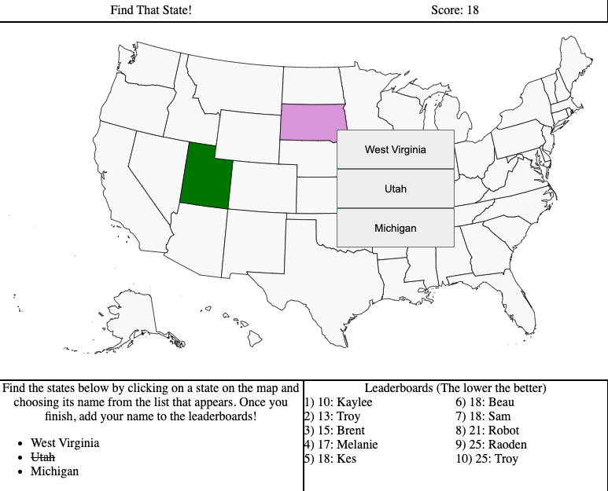

# Hidden-states

A game to test your knowledge of where specific States are, within the United States. The faster you find them, the lower and better, your score.

    

## Features

- Built with React and Firebase.
- Keeps a leaderboard in the cloud.
- Uses an SVG file for the map.
- Add color to states on click, and either keeps a color, or removes it, based on correctness.

## Demo

- https://hidden-countries-ae982.web.app/
